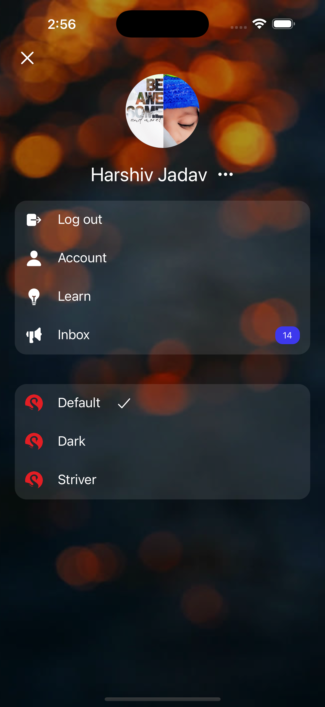
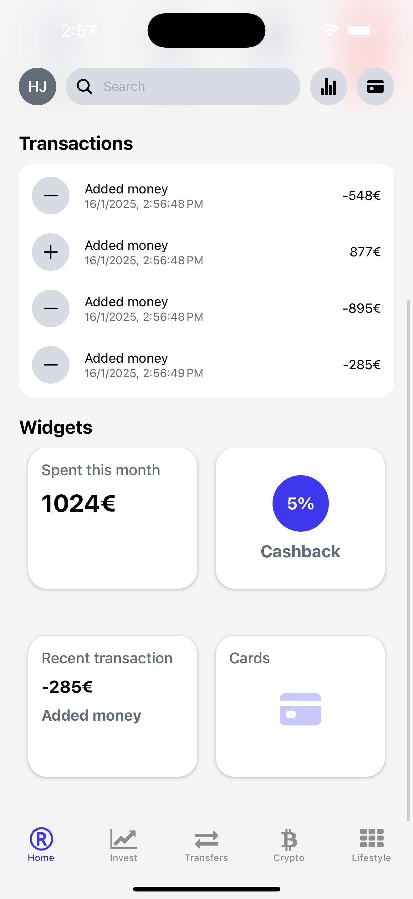

# CryptoFlow: Open-Source Crypto Trading App Clone 🚀

Welcome to **CryptoFlow**, a fully functional open-source cryptocurrency trading app designed to replicate real-world trading platforms. Built with cutting-edge technologies like [React Native](https://reactnative.dev) and [Expo](https://expo.dev), this project is ideal for developers and enthusiasts looking to learn, build, or enhance crypto trading platforms.

---

## Screenshots

<div style="display: flex; flex-direction: 'row';">





</div>


## ✨ Features

- **Live Market Updates**: View real-time cryptocurrency prices and charts.
- **Secure Wallets**: Manage and track your digital assets safely.
- **Trading Simulation**: Buy, sell, and exchange virtual currencies with ease.
- **Customizable UI**: Sleek, responsive design for seamless user experience.
- **API Integration**: Connect to real-world crypto APIs for dynamic data.
- **Built with Expo**: Easy to start, develop, and deploy.

---

## 🚀 Get Started

1. **Install dependencies**:
   ```bash
   npm install
   ```

2. **Start the app**:
   ```bash
   npx expo start
   ```

   You’ll find options to open the app in:
   - A [development build](https://docs.expo.dev/develop/development-builds/introduction/)
   - An [Android emulator](https://docs.expo.dev/workflow/android-studio-emulator/)
   - An [iOS simulator](https://docs.expo.dev/workflow/ios-simulator/)
   - [Expo Go](https://expo.dev/go): A sandbox for app development with Expo.

3. **Customize your project**:
   Edit the files inside the `app` directory to start developing. This project uses [file-based routing](https://docs.expo.dev/router/introduction).

---

## 💻 Fresh Start

When you're ready to start a new project:
```bash
npm run reset-project
```
This will move the starter code to the `app-example` directory and create a blank `app` directory for your development.

---

## 📜 Learn More

- **[Expo documentation](https://docs.expo.dev/):** Learn the basics or dive into advanced guides.
- **[Learn Expo tutorial](https://docs.expo.dev/tutorial/introduction/):** Create a project step-by-step for Android, iOS, and the web.
- **[File-based routing](https://docs.expo.dev/router/introduction):** Simplify navigation in your app.

---

## 🌐 Join the Community

Be part of a vibrant developer community:

- **[Expo on GitHub](https://github.com/expo/expo):** Contribute to the open-source platform.

---

## 🤝 Contribute

We welcome contributions! Open an issue or submit a pull request to improve the project.

---

## 📩 Questions?

Feel free to reach out or open an issue if you have any questions or suggestions!

Happy coding! 🧑‍💻
